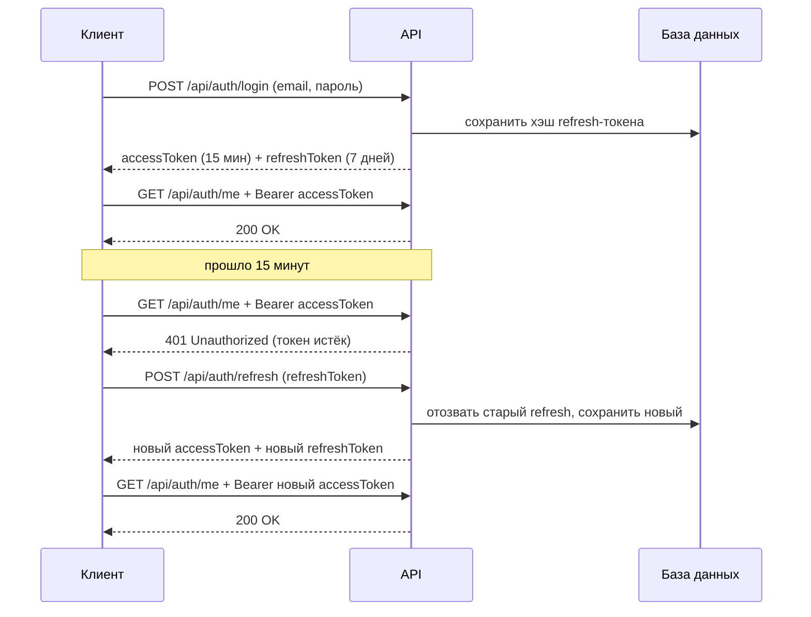
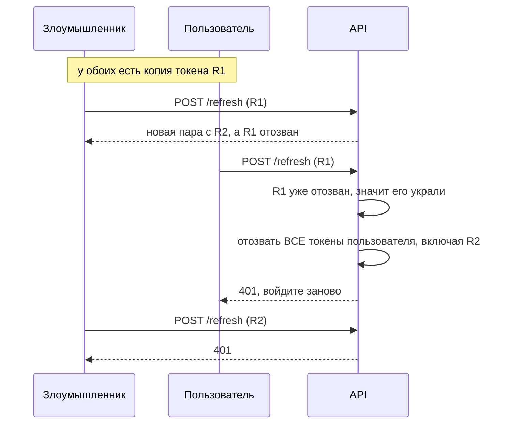

# Лабораторная работа: Refresh-токены и ролевая модель

## Цели работы

После выполнения работы вы сможете:

1. Объяснить, зачем нужна пара **access + refresh** токенов и чем плох один «вечный» токен.
2. Реализовать выдачу, обновление (с **ротацией**) и отзыв refresh-токенов.
3. Обнаруживать повторное использование украденного refresh-токена.
4. Построить ролевую модель **Admin / Manager / User** на атрибутах `[Authorize(Roles = ...)]` и политиках авторизации.
5. Объяснить разницу между **401 Unauthorized** и **403 Forbidden**.

## Что уже есть в проекте

| Файл | Что делает |
|---|---|
| `Models/User.cs` | Пользователь: `Id`, `Email`, `PasswordHash`, `Role` (по умолчанию `"User"`), `CreatedAt` |
| `Services/JwtService.cs` | Создаёт JWT с claims `NameIdentifier`, `Email`, `Role` |
| `Services/PasswordService.cs` | Хэширует пароль через SHA256 |
| `Controllers/AuthController.cs` | `POST /api/auth/register`, `POST /api/auth/login`, `GET /api/auth/me` |
| `Program.cs` | Настройка EF InMemory, JWT-аутентификации и авторизации |

Сейчас при логине выдаётся **один** токен сроком на 60 минут. Роль у всех пользователей одна, и она нигде не проверяется.

## План работы

| Этап | Время |
|---|---|
| Часть 0. Теория | 10 мин |
| Часть 1. Refresh-токены | 35 мин |
| Проверка части 1 | 10 мин |
| Часть 2. Ролевая модель | 25 мин |
| Проверка части 2 и контрольные вопросы | 10 мин |

---

## Часть 0. Теория (10 мин)

### Проблема одного токена

JWT — это **stateless**-токен: сервер проверяет только подпись и срок действия и **не ходит в базу**. Отсюда следствие: **выданный JWT нельзя отозвать**. Он работает до истечения срока.

Возникает дилемма:

- **Токен живёт долго** (например, 30 дней): пользователю удобно, но если токен украдут (XSS, перехват, утечка логов), злоумышленник месяц будет работать от имени жертвы, и мы ничего не сможем сделать. «Выйти из аккаунта» тоже невозможно.
- **Токен живёт коротко** (например, 5 минут): украденный токен быстро протухнет, но пользователь будет вводить пароль каждые 5 минут.

### Решение: два токена

| | Access-токен | Refresh-токен |
|---|---|---|
| Формат | JWT (подписан, содержит claims) | Случайная строка (64 байта) |
| Срок жизни | Короткий: 5–15 минут | Длинный: 7–30 дней |
| Куда отправляется | В **каждый** запрос, заголовок `Authorization: Bearer ...` | **Только** на `/api/auth/refresh` и `/api/auth/logout` |
| Как проверяется | По подписи, без обращения к БД | Поиском в БД |
| Можно отозвать? | Нет, только ждать истечения | Да (поле `RevokedAt`) |

**Access-токен** даёт доступ к ресурсам. Он светится в каждом запросе, поэтому живёт недолго.
**Refresh-токен** нужен только для получения новой пары токенов. Он передаётся редко, хранится в БД и может быть отозван в любой момент.

> **Почему refresh-токен — не JWT?** Его всё равно нужно проверять по базе, чтобы узнать, не отозван ли он. Подпись и claims ничего не добавляют, поэтому достаточно криптостойкой случайной строки.

### Жизненный цикл



### Ротация и обнаружение кражи

**Ротация** означает, что каждый refresh-токен **одноразовый**. При обновлении старый токен отзывается и выдаётся новый.

Если кто-то предъявляет **уже отозванный** токен, значит, у токена две копии: одна у пользователя, другая у злоумышленника. Мы не знаем, кто из них кто, поэтому **отзываем все сессии пользователя**, и ему придётся войти заново по паролю.



### Почему в БД хранится хэш, а не сам токен

Refresh-токен по сути работает как пароль. Если база утечёт, открытые токены сразу можно использовать. Поэтому храним **SHA256-хэш**, а при проверке хэшируем пришедший токен и ищем совпадение.

> Для паролей быстрый SHA256 — плохой выбор: пароли короткие, и их можно перебрать по словарю. Refresh-токен — это 64 случайных байта, перебрать их невозможно, поэтому быстрого хэша достаточно.

### Аутентификация и авторизация

| | Аутентификация | Авторизация |
|---|---|---|
| Вопрос | **Кто** ты? | **Что** тебе можно? |
| Механизм в проекте | JWT Bearer | Роли и политики |
| Код ошибки | **401 Unauthorized**: токена нет, он истёк или подделан | **403 Forbidden**: ты известен, но прав не хватает |

---

## Часть 1. Refresh-токены (35 мин)

### Шаг 1.1. Настройки (`appsettings.json`)

Переименуйте `ExpiresMinutes` в `AccessTokenMinutes` и добавьте `RefreshTokenDays`:

```json
"Jwt": {
    "Key": "1080ab29a52e1dd6a61194026328c191",
    "Issuer": "AuthApi",
    "Audience": "Users",
    "AccessTokenMinutes": "1",
    "RefreshTokenDays": "7"
},
```

> Срок access-токена **1 минута** выставлен специально, чтобы при проверке не ждать 15 минут. В реальном проекте ставят 5–15 минут.

### Шаг 1.2. Модель `RefreshToken`

Создайте файл `Models/RefreshToken.cs`:

```csharp
namespace authApi.Models;

public class RefreshToken
{
  public int Id { get; set; }

  // Храним не сам токен, а его хэш (как с паролями)
  public string TokenHash { get; set; } = string.Empty;

  public int UserId { get; set; }
  public User User { get; set; } = null!;

  public DateTime CreatedAt { get; set; } = DateTime.UtcNow;
  public DateTime ExpiresAt { get; set; }

  // Заполняется, когда токен отозван (logout или ротация)
  public DateTime? RevokedAt { get; set; }

  // Хэш токена, который пришёл на смену этому (цепочка ротации)
  public string? ReplacedByTokenHash { get; set; }

  public bool IsExpired => DateTime.UtcNow >= ExpiresAt;
  public bool IsRevoked => RevokedAt != null;
  public bool IsActive => !IsRevoked && !IsExpired;
}
```

**Разбор:**

- Один пользователь может иметь **много** refresh-токенов: по одному на каждое устройство или браузер (сессию).
- `IsExpired`, `IsRevoked`, `IsActive` — вычисляемые свойства без сеттера. EF Core **не сохраняет** их в БД, они считаются в памяти.
- **Важно:** такие свойства нельзя использовать внутри LINQ-запроса к базе (`.Where(t => t.IsActive)`). EF не сможет перевести их в запрос и выбросит `InvalidOperationException: could not be translated`. В запросах пишите условия по реальным полям: `t.RevokedAt == null`.

### Шаг 1.3. Регистрация таблицы в `AppDbContext`

```csharp
public DbSet<User> Users => Set<User>();
public DbSet<RefreshToken> RefreshTokens => Set<RefreshToken>();   // добавить
```

### Шаг 1.4. Генерация и хэширование в `JwtService`

Замените содержимое `Services/JwtService.cs`:

```csharp
using Microsoft.IdentityModel.Tokens;
using System.IdentityModel.Tokens.Jwt;
using System.Security.Claims;
using System.Security.Cryptography;
using authApi.Models;
using System.Text;

namespace authApi.Services;

public class JwtService
{
  private readonly IConfiguration _configuration;

  public JwtService(IConfiguration configuration)
  {
    _configuration = configuration;
  }

  public string CreateToken(User user)
  {
    var key = _configuration["Jwt:Key"]!;
    var issuer = _configuration["Jwt:Issuer"];
    var audience = _configuration["Jwt:Audience"];
    var expiresMinutes = int.Parse(_configuration["Jwt:AccessTokenMinutes"]!);   // новое имя ключа

    var claims = new List<Claim>
    {
      new Claim(ClaimTypes.NameIdentifier, user.Id.ToString()),
      new Claim(ClaimTypes.Email, user.Email),
      new Claim(ClaimTypes.Role, user.Role)
    };

    var credentials = new SigningCredentials(
      new SymmetricSecurityKey(Encoding.UTF8.GetBytes(key)),
      SecurityAlgorithms.HmacSha256
    );

    var token = new JwtSecurityToken(
      issuer: issuer,
      audience: audience,
      claims: claims,
      expires: DateTime.UtcNow.AddMinutes(expiresMinutes),
      signingCredentials: credentials
    );

    return new JwtSecurityTokenHandler().WriteToken(token);
  }

  // Криптостойкая случайная строка, а не Guid и не Random
  public string CreateRefreshToken()
  {
    var bytes = RandomNumberGenerator.GetBytes(64);
    return Convert.ToBase64String(bytes);
  }

  public string HashToken(string token)
  {
    var bytes = SHA256.HashData(Encoding.UTF8.GetBytes(token));
    return Convert.ToBase64String(bytes);
  }

  public DateTime GetRefreshTokenExpiry()
  {
    var days = int.Parse(_configuration["Jwt:RefreshTokenDays"]!);
    return DateTime.UtcNow.AddDays(days);
  }
}
```

> **Почему `RandomNumberGenerator`, а не `new Random()`?** Последовательность `Random` предсказуема: зная несколько значений, можно вычислить следующие. `RandomNumberGenerator` — криптографический генератор, его вывод угадать нельзя.

### Шаг 1.5. DTO

**`DTOs/AuthResponse.cs`**: теперь возвращаем два токена и роль:

```csharp
namespace authApi.DTOs;

public class AuthResponse
{
  public string AccessToken { get; set; } = string.Empty;
  public string RefreshToken { get; set; } = string.Empty;
  public string Email { get; set; } = string.Empty;
  public string Role { get; set; } = string.Empty;
}
```

**`DTOs/RefreshRequest.cs`** (новый файл):

```csharp
namespace authApi.DTOs;

public class RefreshRequest
{
  public string RefreshToken { get; set; } = string.Empty;
}
```

### Шаг 1.6. Убираем «запас времени» у JWT (`Program.cs`)

По умолчанию JwtBearer принимает токен ещё **5 минут** после истечения. Это параметр `ClockSkew`, запас на рассинхронизацию часов между серверами. С ним токен «на 1 минуту» будет работать 6 минут, и проверка не получится.

Добавьте в `TokenValidationParameters` одну строку:

```csharp
options.TokenValidationParameters = new TokenValidationParameters
{
    ValidateIssuer = true,
    ValidateAudience = true,
    ValidateLifetime = true,
    ValidateIssuerSigningKey = true,
    ValidIssuer = builder.Configuration["Jwt:Issuer"],
    ValidAudience = builder.Configuration["Jwt:Audience"],
    IssuerSigningKey = new SymmetricSecurityKey(keyBytes),
    ClockSkew = TimeSpan.Zero   // добавить
};
```

### Шаг 1.7. `AuthController`: выдача, обновление, выход

#### 1.7.1. Вспомогательный метод выдачи пары токенов

Одна и та же логика нужна и при логине, и при обновлении, поэтому вынесем её в приватный метод. Добавьте в конец класса `AuthController`:

```csharp
  private async Task<AuthResponse> IssueTokensAsync(User user, RefreshToken? oldToken = null)
  {
    var accessToken = _jwtService.CreateToken(user);
    var refreshToken = _jwtService.CreateRefreshToken();
    var refreshTokenHash = _jwtService.HashToken(refreshToken);

    // Ротация: если это обновление, отзываем старый токен
    if (oldToken != null)
    {
      oldToken.RevokedAt = DateTime.UtcNow;
      oldToken.ReplacedByTokenHash = refreshTokenHash;
    }

    _db.RefreshTokens.Add(new RefreshToken
    {
      TokenHash = refreshTokenHash,   // в БД только хэш
      UserId = user.Id,
      ExpiresAt = _jwtService.GetRefreshTokenExpiry()
    });

    await _db.SaveChangesAsync();

    return new AuthResponse
    {
      AccessToken = accessToken,
      RefreshToken = refreshToken,    // клиенту отдаём сам токен
      Email = user.Email,
      Role = user.Role
    };
  }

  private async Task RevokeAllUserTokensAsync(int userId)
  {
    var activeTokens = await _db.RefreshTokens
      .Where(token => token.UserId == userId && token.RevokedAt == null)
      .ToListAsync();

    foreach (var token in activeTokens)
    {
      token.RevokedAt = DateTime.UtcNow;
    }

    await _db.SaveChangesAsync();
  }
```

> Клиент получает **сам токен** и больше нигде его не увидит. В базе остаётся только хэш, поэтому восстановить токен из БД невозможно.

#### 1.7.2. Изменяем `Login`

Замените конец метода `Login`, где раньше создавался один токен:

```csharp
    // было:
    // var token = _jwtService.CreateToken(user);
    // return Ok(new AuthResponse { Token = token, Email = user.Email });

    var response = await IssueTokensAsync(user);

    return Ok(response);
```

#### 1.7.3. Эндпоинт `POST /api/auth/refresh`

```csharp
  [HttpPost("refresh")]
  [AllowAnonymous]
  public async Task<ActionResult<AuthResponse>> Refresh(RefreshRequest request)
  {
    var tokenHash = _jwtService.HashToken(request.RefreshToken);

    var storedToken = await _db.RefreshTokens
      .Include(token => token.User)
      .FirstOrDefaultAsync(token => token.TokenHash == tokenHash);

    if (storedToken == null)
    {
      return Unauthorized("Недействительный refresh-токен");
    }

    // Токен уже отозван, но им снова пытаются воспользоваться.
    // Значит, его украли: отзываем ВСЕ сессии пользователя.
    if (storedToken.IsRevoked)
    {
      await RevokeAllUserTokensAsync(storedToken.UserId);
      return Unauthorized("Refresh-токен уже использован. Все сессии завершены");
    }

    if (storedToken.IsExpired)
    {
      return Unauthorized("Срок действия refresh-токена истёк");
    }

    var response = await IssueTokensAsync(storedToken.User, storedToken);

    return Ok(response);
  }
```

**Разбор:**

- `[AllowAnonymous]`: к моменту обновления access-токен **уже истёк**, поэтому требовать его нельзя. Доказательство личности здесь — сам refresh-токен.
- `.Include(token => token.User)` загружает пользователя одним запросом. Пользователь нужен, чтобы выписать новый access-токен **с актуальными данными из БД**, включая текущую роль. Это пригодится в части 2.
- Порядок проверок важен: сначала «отозван», потом «истёк». Повторное использование — признак атаки, и на него реагируем в первую очередь.

#### 1.7.4. Эндпоинт `POST /api/auth/logout`

```csharp
  [HttpPost("logout")]
  [AllowAnonymous]
  public async Task<IActionResult> Logout(RefreshRequest request)
  {
    var tokenHash = _jwtService.HashToken(request.RefreshToken);

    var storedToken = await _db.RefreshTokens
      .FirstOrDefaultAsync(token => token.TokenHash == tokenHash);

    if (storedToken != null && storedToken.IsActive)
    {
      storedToken.RevokedAt = DateTime.UtcNow;
      await _db.SaveChangesAsync();
    }

    return NoContent();
  }
```

**Разбор:**

- Выход — это отзыв refresh-токена **текущей** сессии. Сессии на других устройствах продолжают работать.
- Метод всегда отвечает `204`, даже если токена нет. Так мы не подсказываем атакующему, существует ли такой токен.
- **Access-токен после logout ещё работает** до своего истечения (до 1 минуты в нашей настройке). Это цена stateless-подхода и главная причина делать access-токен коротким. Клиент при выходе просто удаляет оба токена у себя.

---

### Проверка части 1 (10 мин)

Запустите проект (`dotnet run`, профиль `http`, адрес `http://localhost:5033`).

Создайте в корне проекта файл `AuthApi.http`. Он работает в Visual Studio 2022 (17.12+) и в VS Code с расширением REST Client. В Rider или Postman копируйте токены из ответов вручную.

```http
@host = http://localhost:5033

### 1. Регистрация
POST {{host}}/api/auth/register
Content-Type: application/json

{ "email": "user@example.com", "password": "User123!" }

### 2. Логин: получаем пару токенов
# @name loginUser
POST {{host}}/api/auth/login
Content-Type: application/json

{ "email": "user@example.com", "password": "User123!" }

### 3. Доступ с access-токеном: ожидаем 200
GET {{host}}/api/auth/me
Authorization: Bearer {{loginUser.response.body.$.accessToken}}

### 4. Подождите 1 минуту и повторите запрос 3: ожидаем 401

### 5. Обновление: ожидаем 200 и НОВУЮ пару токенов
# @name refreshUser
POST {{host}}/api/auth/refresh
Content-Type: application/json

{ "refreshToken": "{{loginUser.response.body.$.refreshToken}}" }

### 6. Новый access-токен работает: ожидаем 200
GET {{host}}/api/auth/me
Authorization: Bearer {{refreshUser.response.body.$.accessToken}}

### 7. Повторно используем СТАРЫЙ refresh-токен: ожидаем 401 "Все сессии завершены"
POST {{host}}/api/auth/refresh
Content-Type: application/json

{ "refreshToken": "{{loginUser.response.body.$.refreshToken}}" }

### 8. НОВЫЙ refresh-токен тоже отозван после обнаружения кражи: ожидаем 401
POST {{host}}/api/auth/refresh
Content-Type: application/json

{ "refreshToken": "{{refreshUser.response.body.$.refreshToken}}" }
```

**Проверка logout:** снова выполните запрос 2 (логин), затем:

```http
### 9. Выход: ожидаем 204
POST {{host}}/api/auth/logout
Content-Type: application/json

{ "refreshToken": "{{loginUser.response.body.$.refreshToken}}" }

### 10. Обновление после выхода: ожидаем 401
POST {{host}}/api/auth/refresh
Content-Type: application/json

{ "refreshToken": "{{loginUser.response.body.$.refreshToken}}" }
```

> База InMemory живёт только в памяти процесса. **После перезапуска приложения все пользователи и токены пропадают**, и регистрироваться нужно заново.

---

## Часть 2. Ролевая модель (25 мин)

### Матрица прав

| Действие | Эндпоинт | User | Manager | Admin |
|---|---|:-:|:-:|:-:|
| Свой профиль | `GET /api/auth/me` | ✅ | ✅ | ✅ |
| Список пользователей | `GET /api/users` | ❌ 403 | ✅ | ✅ |
| Изменить роль | `PUT /api/users/{id}/role` | ❌ 403 | ❌ 403 | ✅ |
| Удалить пользователя | `DELETE /api/users/{id}` | ❌ 403 | ❌ 403 | ✅ |
| Любой из них без токена | | 401 | 401 | 401 |

Роль уже хранится в `User.Role` и попадает в JWT как claim `ClaimTypes.Role` (см. `JwtService`). Осталось **проверять** её.

### Шаг 2.1. Константы ролей и политик

Строки вроде `"Admin"`, разбросанные по коду, — источник ошибок: опечатка в `"Admn"` не вызовет ошибки компиляции, а доступ сломается. Поэтому заведём константы.

**`Security/Roles.cs`**:

```csharp
namespace authApi.Security;

public static class Roles
{
  public const string Admin = "Admin";
  public const string Manager = "Manager";
  public const string User = "User";

  public static readonly string[] All = { Admin, Manager, User };
}
```

**`Security/Policies.cs`**:

```csharp
namespace authApi.Security;

public static class Policies
{
  public const string AdminOnly = "AdminOnly";
  public const string ManagerOrAdmin = "ManagerOrAdmin";
}
```

> Значения объявлены через `const`: в аргументах атрибутов (`[Authorize(Roles = ...)]`) можно использовать только константы.

Обновите значение по умолчанию в `Models/User.cs`:

```csharp
using authApi.Security;

namespace authApi.Models;

public class User
{
  // ...
  public string Role { get; set; } = Roles.User;
  // ...
}
```

### Шаг 2.2. Политики авторизации (`Program.cs`)

Есть два способа ограничить доступ:

1. **По роли напрямую:** `[Authorize(Roles = "Admin")]`. Просто, но правило «кому можно» размазано по контроллерам.
2. **Через политику:** `[Authorize(Policy = "ManagerOrAdmin")]`. Правило описано **в одном месте**, а контроллер ссылается на него по имени. Если завтра доступ к списку пользователей получит роль `Support`, мы поменяем одну строку в `Program.cs`, а не все атрибуты в контроллерах.

В этой работе используем оба способа, чтобы увидеть разницу.

Добавьте в `Program.cs` после `AddAuthentication(...).AddJwtBearer(...)`:

```csharp
builder.Services.AddAuthorization(options =>
{
   options.AddPolicy(Policies.AdminOnly, policy =>
       policy.RequireRole(Roles.Admin));

   options.AddPolicy(Policies.ManagerOrAdmin, policy =>
       policy.RequireRole(Roles.Manager, Roles.Admin));   // ИЛИ: любая из ролей
});
```

И `using authApi.Security;` в начало файла.

### Шаг 2.3. Первый администратор (сидинг)

Все регистрируются с ролью `User`, а менять роли может только админ. Кто же назначит первого админа? Эту проблему курицы и яйца решает **сидинг**: при старте приложения создаём администратора из конфигурации.

Добавьте в `appsettings.json`:

```json
"SeedAdmin": {
    "Email": "admin@example.com",
    "Password": "Admin123!"
},
```

> Это учебные данные. В реальном проекте пароль администратора не хранят в `appsettings.json` под git: его передают через переменные окружения или User Secrets.

Создайте **`Data/DbSeeder.cs`**:

```csharp
using authApi.Models;
using authApi.Security;
using authApi.Services;

namespace authApi.Data;

public static class DbSeeder
{
  public static void SeedAdmin(IServiceProvider services, IConfiguration configuration)
  {
    // DbContext зарегистрирован как Scoped, поэтому вне HTTP-запроса
    // нужно вручную создать область (scope)
    using var scope = services.CreateScope();
    var db = scope.ServiceProvider.GetRequiredService<AppDbContext>();
    var passwordService = scope.ServiceProvider.GetRequiredService<PasswordService>();

    if (db.Users.Any(user => user.Role == Roles.Admin))
    {
      return;
    }

    db.Users.Add(new User
    {
      Email = configuration["SeedAdmin:Email"]!,
      PasswordHash = passwordService.HashPassword(configuration["SeedAdmin:Password"]!),
      Role = Roles.Admin
    });

    db.SaveChanges();
  }
}
```

Вызовите его в `Program.cs` сразу после `var app = builder.Build();`:

```csharp
var app = builder.Build();

DbSeeder.SeedAdmin(app.Services, app.Configuration);   // добавить
```

> **Почему в `RegisterRequest` нет поля `Role`?** Если бы оно было, любой мог бы отправить `{"role": "Admin"}` при регистрации и стать администратором. Это уязвимость **повышения привилегий**, и она часто встречается на практике. Роль назначает только сервер.

### Шаг 2.4. DTO для смены роли

**`DTOs/ChangeRoleRequest.cs`**:

```csharp
namespace authApi.DTOs;

public class ChangeRoleRequest
{
  public string Role { get; set; } = string.Empty;
}
```

### Шаг 2.5. `UsersController`

Создайте **`Controllers/UsersController.cs`**:

```csharp
using System.Security.Claims;
using authApi.Data;
using authApi.DTOs;
using authApi.Security;
using Microsoft.AspNetCore.Authorization;
using Microsoft.AspNetCore.Mvc;
using Microsoft.EntityFrameworkCore;

namespace authApi.Controllers;

[ApiController]
[Route("api/users")]
[Authorize]   // все методы контроллера требуют входа
public class UsersController : ControllerBase
{
  private readonly AppDbContext _db;

  public UsersController(AppDbContext db)
  {
    _db = db;
  }

  // Список пользователей: менеджер и админ (через политику)
  [HttpGet]
  [Authorize(Policy = Policies.ManagerOrAdmin)]
  public async Task<IActionResult> GetAll()
  {
    var users = await _db.Users
      .Select(user => new { user.Id, user.Email, user.Role, user.CreatedAt })
      .ToListAsync();

    return Ok(users);
  }

  // Смена роли: только админ (через роль напрямую)
  [HttpPut("{id:int}/role")]
  [Authorize(Roles = Roles.Admin)]
  public async Task<IActionResult> ChangeRole(int id, ChangeRoleRequest request)
  {
    if (!Roles.All.Contains(request.Role))
    {
      return BadRequest($"Неизвестная роль. Допустимые: {string.Join(", ", Roles.All)}");
    }

    if (id == GetCurrentUserId())
    {
      return BadRequest("Нельзя изменить роль самому себе");
    }

    var user = await _db.Users.FindAsync(id);

    if (user == null)
    {
      return NotFound();
    }

    user.Role = request.Role;
    await _db.SaveChangesAsync();

    return Ok(new { user.Id, user.Email, user.Role });
  }

  // Удаление пользователя: только админ (через политику)
  [HttpDelete("{id:int}")]
  [Authorize(Policy = Policies.AdminOnly)]
  public async Task<IActionResult> Delete(int id)
  {
    if (id == GetCurrentUserId())
    {
      return BadRequest("Нельзя удалить самого себя");
    }

    var user = await _db.Users.FindAsync(id);

    if (user == null)
    {
      return NotFound();
    }

    // Удаляем и все refresh-токены пользователя
    var tokens = await _db.RefreshTokens
      .Where(token => token.UserId == id)
      .ToListAsync();

    _db.RefreshTokens.RemoveRange(tokens);
    _db.Users.Remove(user);
    await _db.SaveChangesAsync();

    return NoContent();
  }

  private int GetCurrentUserId()
  {
    return int.Parse(User.FindFirstValue(ClaimTypes.NameIdentifier)!);
  }
}
```

**Разбор:**

- `[Authorize]` на классе и `[Authorize(...)]` на методе **складываются**: пользователь должен быть аутентифицирован **и** удовлетворять требованию метода.
- Запрет менять роль себе и удалять себя защищает от ситуации, когда единственный админ случайно лишает себя прав и в системе не остаётся администратора.
- Refresh-токены удаляем вручную: провайдер InMemory не поддерживает `ExecuteDeleteAsync` и каскадное удаление на уровне БД.
- Атрибут проверяет, **кто** делает запрос: «ты админ?». Проверки, зависящие от **конкретного объекта** («не себя ли ты удаляешь?»), пишутся в коде метода.

### Шаг 2.6. Как связаны роли и refresh-токены

Роль записана **внутри access-токена**. Если админ повысил пользователя до `Manager`, у пользователя на руках остаётся токен со старой ролью `User`, и он продолжает получать 403.

Новая роль появится в токене только при следующей выдаче, то есть при логине или **при refresh**: метод `Refresh` берёт пользователя из БД, а значит, и актуальную роль.

То же самое работает в обратную сторону: если у админа **отобрали** права, старый access-токен с ролью `Admin` проработает до истечения. Это ещё одна причина делать access-токены короткими.

---

### Проверка части 2 (10 мин)

Перезапустите приложение, чтобы сработал сидинг. Добавьте в `AuthApi.http`:

```http
### 11. Регистрация обычного пользователя (после перезапуска БД пустая)
POST {{host}}/api/auth/register
Content-Type: application/json

{ "email": "user@example.com", "password": "User123!" }

### 12. Логин пользователем
# @name loginUser2
POST {{host}}/api/auth/login
Content-Type: application/json

{ "email": "user@example.com", "password": "User123!" }

### 13. User пытается получить список: ожидаем 403
GET {{host}}/api/users
Authorization: Bearer {{loginUser2.response.body.$.accessToken}}

### 14. Без токена: ожидаем 401
GET {{host}}/api/users

### 15. Логин админом
# @name loginAdmin
POST {{host}}/api/auth/login
Content-Type: application/json

{ "email": "admin@example.com", "password": "Admin123!" }

### 16. Админ видит список: ожидаем 200 (admin — Id 1, user — Id 2)
GET {{host}}/api/users
Authorization: Bearer {{loginAdmin.response.body.$.accessToken}}

### 17. Админ повышает пользователя до Manager: ожидаем 200
PUT {{host}}/api/users/2/role
Authorization: Bearer {{loginAdmin.response.body.$.accessToken}}
Content-Type: application/json

{ "role": "Manager" }

### 18. У пользователя СТАРЫЙ токен с ролью User: всё ещё 403
GET {{host}}/api/users
Authorization: Bearer {{loginUser2.response.body.$.accessToken}}

### 19. Пользователь обновляет токены: в ответе "role": "Manager"
# @name refreshManager
POST {{host}}/api/auth/refresh
Content-Type: application/json

{ "refreshToken": "{{loginUser2.response.body.$.refreshToken}}" }

### 20. Теперь у менеджера есть доступ к списку: ожидаем 200
GET {{host}}/api/users
Authorization: Bearer {{refreshManager.response.body.$.accessToken}}

### 21. Менеджер пытается менять роли: ожидаем 403
PUT {{host}}/api/users/1/role
Authorization: Bearer {{refreshManager.response.body.$.accessToken}}
Content-Type: application/json

{ "role": "User" }

### 22. Админ пытается изменить роль себе: ожидаем 400
PUT {{host}}/api/users/1/role
Authorization: Bearer {{loginAdmin.response.body.$.accessToken}}
Content-Type: application/json

{ "role": "User" }

### 23. Несуществующая роль: ожидаем 400
PUT {{host}}/api/users/2/role
Authorization: Bearer {{loginAdmin.response.body.$.accessToken}}
Content-Type: application/json

{ "role": "SuperAdmin" }

### 24. Админ удаляет пользователя: ожидаем 204
DELETE {{host}}/api/users/2
Authorization: Bearer {{loginAdmin.response.body.$.accessToken}}
```

> Access-токены в этой работе живут 1 минуту. Если запрос неожиданно вернул 401, скорее всего, токен истёк: повторите логин или refresh.

---

## Частые ошибки

| Симптом | Причина |
|---|---|
| Токен «на 1 минуту» работает ещё 5 минут | Не выставлен `ClockSkew = TimeSpan.Zero` |
| `could not be translated` при запросе | Вычисляемое свойство (`IsActive`, `IsRevoked`) внутри `.Where(...)` к БД |
| `NullReferenceException` в `Refresh` на `storedToken.User` | Забыли `.Include(token => token.User)` |
| Админ получает 403 | Роль в БД записана как `"admin"` или `"ADMIN"`: сравнение ролей регистрозависимое |
| Повышенный пользователь всё ещё получает 403 | В access-токене старая роль, нужно выполнить refresh (шаг 2.6) |
| После перезапуска «Неверный email или пароль» | База InMemory очищается при перезапуске |
| Ошибка компиляции в `JwtService` на `ExpiresMinutes` | Ключ переименован в `AccessTokenMinutes` (шаг 1.1) |

---

## Контрольные вопросы

1. Почему нельзя просто выдать один access-токен на 30 дней?
2. Почему refresh-токен сделан случайной строкой, а не JWT?
3. Почему в БД хранится хэш refresh-токена? Почему для него подходит SHA256, а для паролей — нет?
4. Что такое ротация refresh-токенов? Что делает сервер, если предъявлен уже использованный токен, и почему именно так?
5. Зачем мы выставили `ClockSkew = TimeSpan.Zero`?
6. После logout access-токен ещё работает. Почему? Как это можно исправить?
7. Чем 401 отличается от 403? Приведите по примеру из этой работы.
8. Почему в `RegisterRequest` нет поля `Role`?
9. Админ повысил пользователя до Manager, но тот получает 403. Почему, и что нужно сделать?
10. Чем `[Authorize(Roles = ...)]` отличается от `[Authorize(Policy = ...)]`? Когда удобнее каждый вариант?
11. Почему администратору запрещено менять роль себе и удалять себя?

---

## Дополнительные задания (для тех, кто закончил раньше)

1. **Блокировка пользователей менеджером.** Добавьте в `User` поле `IsBlocked` и эндпоинт `PUT /api/users/{id}/block` для Manager и Admin. Менеджер может блокировать **только** пользователей с ролью `User`, а не других менеджеров и админов. Заблокированный пользователь не может выполнить `login` и `refresh`.
   *Подсказка:* атрибут `[Authorize]` проверяет роль вызывающего, а ограничение «только User» зависит от объекта, поэтому пишется в коде метода.
2. **Отзыв сессий при понижении роли.** При смене роли в `ChangeRole` отзывайте все refresh-токены пользователя. Какие плюсы и минусы у этого решения?
3. **Выход со всех устройств.** Эндпоинт `POST /api/auth/logout-all` с `[Authorize]`: отзывает все активные refresh-токены текущего пользователя.
4. **Очистка мусора.** Напишите `BackgroundService`, который раз в час удаляет из БД просроченные и давно отозванные refresh-токены.
5. **Refresh-токен в cookie.** Отдавайте refresh-токен не в теле ответа, а в `HttpOnly`, `Secure`, `SameSite=Strict` cookie с `Path=/api/auth`. От какой атаки это защищает?
6. **Хэширование паролей.** Замените SHA256 в `PasswordService` на `PasswordHasher<User>` из `Microsoft.AspNetCore.Identity`. Чем он лучше?

---

## Что сдать

1. Код проекта с реализованными частями 1 и 2.
2. Файл `AuthApi.http` со всеми сценариями проверки.
3. Устные ответы на контрольные вопросы.

---

## Приложение: итоговые файлы целиком

<details>
<summary><code>Program.cs</code></summary>

```csharp
using System.Text;
using authApi.Data;
using authApi.Security;
using authApi.Services;
using Microsoft.AspNetCore.Authentication.JwtBearer;
using Microsoft.EntityFrameworkCore;
using Microsoft.IdentityModel.Tokens;

var builder = WebApplication.CreateBuilder(args);

builder.Services.AddControllers();

builder.Services.AddDbContext<AppDbContext>(options =>
{
    options.UseInMemoryDatabase("AppDb");
});

builder.Services.AddScoped<PasswordService>();
builder.Services.AddScoped<JwtService>();

var jwtKey = builder.Configuration["Jwt:Key"]!;
var keyBytes = Encoding.UTF8.GetBytes(jwtKey);

builder.Services.AddAuthentication(options =>
{
   options.DefaultAuthenticateScheme = JwtBearerDefaults.AuthenticationScheme;
   options.DefaultChallengeScheme = JwtBearerDefaults.AuthenticationScheme;
}).AddJwtBearer(options =>
{
   options.TokenValidationParameters = new TokenValidationParameters
   {
       ValidateIssuer = true,
       ValidateAudience = true,
       ValidateLifetime = true,
       ValidateIssuerSigningKey = true,
       ValidIssuer = builder.Configuration["Jwt:Issuer"],
       ValidAudience = builder.Configuration["Jwt:Audience"],
       IssuerSigningKey = new SymmetricSecurityKey(keyBytes),
       ClockSkew = TimeSpan.Zero
   };
});

builder.Services.AddAuthorization(options =>
{
   options.AddPolicy(Policies.AdminOnly, policy =>
       policy.RequireRole(Roles.Admin));

   options.AddPolicy(Policies.ManagerOrAdmin, policy =>
       policy.RequireRole(Roles.Manager, Roles.Admin));
});

var app = builder.Build();

DbSeeder.SeedAdmin(app.Services, app.Configuration);

app.UseAuthentication();

app.UseHttpsRedirection();
app.UseRouting();

app.UseAuthorization();

app.MapStaticAssets();

app.MapControllerRoute(
    name: "default",
    pattern: "{controller=Home}/{action=Index}/{id?}")
    .WithStaticAssets();

app.Run();
```

</details>

<details>
<summary><code>Controllers/AuthController.cs</code></summary>

```csharp
using System.Security.Claims;
using authApi.Data;
using authApi.DTOs;
using authApi.Models;
using authApi.Services;
using Microsoft.AspNetCore.Authorization;
using Microsoft.AspNetCore.Mvc;
using Microsoft.EntityFrameworkCore;

namespace authApi.Controllers;

[ApiController]
[Route("api/auth")]
public class AuthController : ControllerBase
{
  private readonly AppDbContext _db;
  private readonly PasswordService _passwordService;
  private readonly JwtService _jwtService;

  public AuthController(AppDbContext db, PasswordService passwordService, JwtService jwtService)
  {
    _db = db;
    _passwordService = passwordService;
    _jwtService = jwtService;
  }

  [HttpPost("register")]
  [AllowAnonymous]
  public async Task<IActionResult> Register(RegisterRequest request)
  {
    var exists = await _db.Users.AnyAsync(user => user.Email == request.Email);

    if (exists)
    {
      return BadRequest("Пользователь с таким Email уже существует");
    }

    var user = new User
    {
      Email = request.Email,
      PasswordHash = _passwordService.HashPassword(request.Password)
    };

    _db.Users.Add(user);
    await _db.SaveChangesAsync();

    return Ok("Пользователь создан");
  }

  [HttpPost("login")]
  [AllowAnonymous]
  public async Task<ActionResult<AuthResponse>> Login(LoginRequest request)
  {
    var user = await _db.Users.FirstOrDefaultAsync(user => user.Email == request.Email);

    if (user == null)
    {
      return Unauthorized("Неверный email или пароль");
    }

    var valid = _passwordService.VerifyPassword(request.Password, user.PasswordHash);

    if (!valid)
    {
      return Unauthorized("Неверный email или пароль");
    }

    var response = await IssueTokensAsync(user);

    return Ok(response);
  }

  [HttpPost("refresh")]
  [AllowAnonymous]
  public async Task<ActionResult<AuthResponse>> Refresh(RefreshRequest request)
  {
    var tokenHash = _jwtService.HashToken(request.RefreshToken);

    var storedToken = await _db.RefreshTokens
      .Include(token => token.User)
      .FirstOrDefaultAsync(token => token.TokenHash == tokenHash);

    if (storedToken == null)
    {
      return Unauthorized("Недействительный refresh-токен");
    }

    if (storedToken.IsRevoked)
    {
      await RevokeAllUserTokensAsync(storedToken.UserId);
      return Unauthorized("Refresh-токен уже использован. Все сессии завершены");
    }

    if (storedToken.IsExpired)
    {
      return Unauthorized("Срок действия refresh-токена истёк");
    }

    var response = await IssueTokensAsync(storedToken.User, storedToken);

    return Ok(response);
  }

  [HttpPost("logout")]
  [AllowAnonymous]
  public async Task<IActionResult> Logout(RefreshRequest request)
  {
    var tokenHash = _jwtService.HashToken(request.RefreshToken);

    var storedToken = await _db.RefreshTokens
      .FirstOrDefaultAsync(token => token.TokenHash == tokenHash);

    if (storedToken != null && storedToken.IsActive)
    {
      storedToken.RevokedAt = DateTime.UtcNow;
      await _db.SaveChangesAsync();
    }

    return NoContent();
  }

  [HttpGet("me")]
  [Authorize]
  public async Task<IActionResult> Me()
  {
    var userId = User.FindFirstValue(ClaimTypes.NameIdentifier);

    if (!int.TryParse(userId, out var id))
    {
      return Unauthorized();
    }

    var user = await _db.Users.FindAsync(id);

    if (user == null)
    {
      return Unauthorized();
    }

    return Ok(new
    {
      user.Id,
      user.Email,
      user.Role,
      user.CreatedAt
    });
  }

  private async Task<AuthResponse> IssueTokensAsync(User user, RefreshToken? oldToken = null)
  {
    var accessToken = _jwtService.CreateToken(user);
    var refreshToken = _jwtService.CreateRefreshToken();
    var refreshTokenHash = _jwtService.HashToken(refreshToken);

    if (oldToken != null)
    {
      oldToken.RevokedAt = DateTime.UtcNow;
      oldToken.ReplacedByTokenHash = refreshTokenHash;
    }

    _db.RefreshTokens.Add(new RefreshToken
    {
      TokenHash = refreshTokenHash,
      UserId = user.Id,
      ExpiresAt = _jwtService.GetRefreshTokenExpiry()
    });

    await _db.SaveChangesAsync();

    return new AuthResponse
    {
      AccessToken = accessToken,
      RefreshToken = refreshToken,
      Email = user.Email,
      Role = user.Role
    };
  }

  private async Task RevokeAllUserTokensAsync(int userId)
  {
    var activeTokens = await _db.RefreshTokens
      .Where(token => token.UserId == userId && token.RevokedAt == null)
      .ToListAsync();

    foreach (var token in activeTokens)
    {
      token.RevokedAt = DateTime.UtcNow;
    }

    await _db.SaveChangesAsync();
  }
}
```

</details>

### Итоговая структура проекта

```
AuthApi/
├── Controllers/
│   ├── AuthController.cs      (изменён: login, refresh, logout)
│   └── UsersController.cs     (новый)
├── Data/
│   ├── AppDbContext.cs        (изменён: DbSet<RefreshToken>)
│   └── DbSeeder.cs            (новый)
├── DTOs/
│   ├── AuthResponse.cs        (изменён)
│   ├── ChangeRoleRequest.cs   (новый)
│   ├── LoginRequest.cs
│   ├── RefreshRequest.cs      (новый)
│   └── RegisterRequest.cs
├── Models/
│   ├── RefreshToken.cs        (новый)
│   └── User.cs                (изменён: Roles.User)
├── Security/
│   ├── Policies.cs            (новый)
│   └── Roles.cs               (новый)
├── Services/
│   ├── JwtService.cs          (изменён)
│   └── PasswordService.cs
├── AuthApi.http               (новый)
├── appsettings.json           (изменён)
└── Program.cs                 (изменён)
```